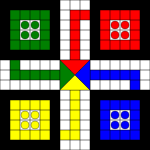

# Ludo Gymnasium Environment [Work In Progress][Mostly Working]

This project implements a Ludo board game environment using the Gymnasium framework. It provides a multi-agent reinforcement learning environment for the classic board game Ludo.



## Features

- Supports 4 players
- Implements basic Ludo rules including:
  - Dice rolling
  - Moving pieces
  - Capturing opponent's pieces
  - Safe spots (starting positions)
  - Winning condition
- Minimal dependencies (only requires Gymnasium)
- Includes a detailed console rendering of the game state

## Installation

1. Ensure you have Python 3.7 or later installed.
2. Install the required dependency:

   ```
   pip install gymnasium
   ```

3. Copy the `MultiAgentLudoEnv` class into your project.

## Usage

Here's a basic example of how to use the environment:

```python
import gymnasium as gym

# Make sure to register the environment first
gym.register(
    id='MultiAgentLudo-v0',
    entry_point='your_module_name:MultiAgentLudoEnv',
)

env = gym.make('MultiAgentLudo-v0')
env.reset()

for agent in env.agent_iter():
    observation, reward, termination, truncation, info = env.last()

    if termination or truncation:
        print(f"Agent {agent} has reached the final square.")
        break
    # this is where you would insert your policy
    action = env.action_space(agent).sample()
    env.step(action)
    env.render()
env.close()
```

## Customization

You can easily extend or modify the environment to add more complex Ludo rules or change the game dynamics. The main class `MultiAgentLudoEnv` is designed to be flexible and easy to understand.

## Contributing

Contributions to improve the environment or add new features are welcome. Please feel free to submit issues or pull requests.

## License

This project is open-source and available under the MIT License.